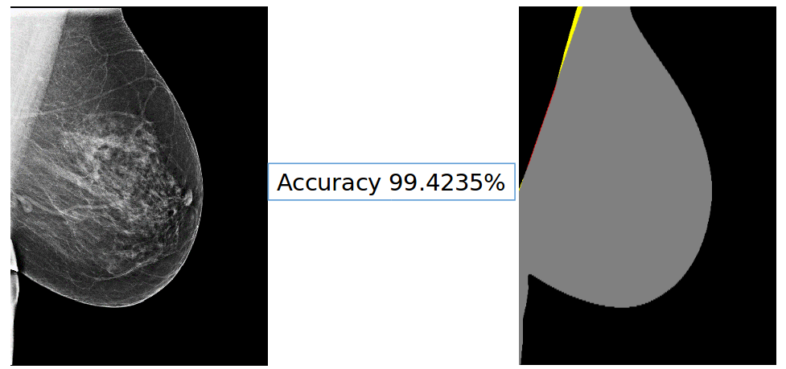

# Pectorial-Muscle-Segmentation
The goal of the project was to segment pectoral musle of mamaogram images. Impalementation was done in C++ using QT and OpenCv.

## Softwares required
- Qt 5.7
- OpenCv3.2

## sample output
Red collor indicates False positive and Yellow collor is for False positive.

